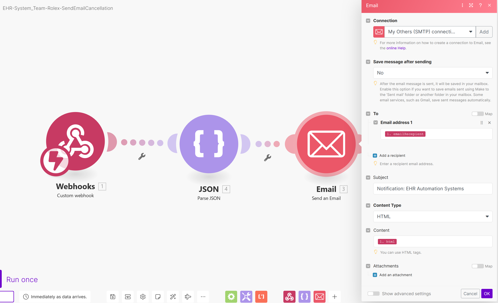
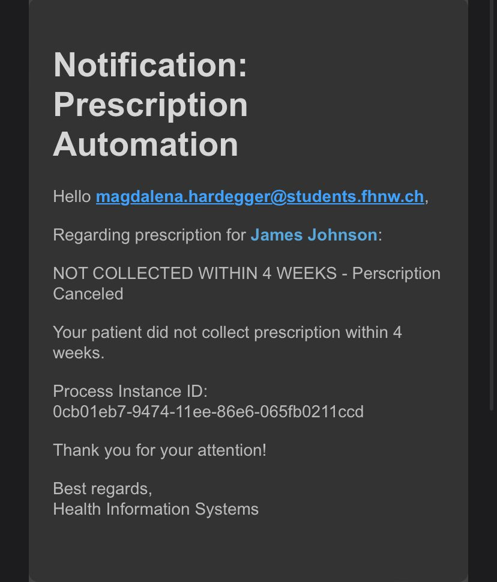

# Team-Rolex - Fast medication automation

## Team Members 👩🏽‍⚕️👩🏻‍⚕️👩🏻‍⚕️👨🏽‍⚕️

| Names  | Emails |
| ------------- | ------------- |
| Sebastian Fernandez | sebastian.fernandez@students.fhnw.ch |
| Bojana Chen | bojana.chen@students.fhnw.ch |
| Gerardo Romeny | gerardo.romenykunstmann@students.fhnw.ch |
| Magdalena Hardegger | magdalena.hardegger@students.fhnw.ch |

## Links 🔗
- API: [DeepNote](https://deepnote.com/workspace/daught-90c8f362-c010-4677-9f84-fd2c734b75ff/project/Sebastians-Untitled-project-927aa70e-3479-4236-ae8d-88111fb4fd4f/notebook/EHR-System-6c884184676d4ab89132c5ffc9ce726a?) (Latest Version )
- Google Forms: [Prescription](https://docs.google.com/forms/d/e/1FAIpQLSfstGW4yB3cxIRQ82-GTqZaBRwxqpLLB7HepLd9glbCm5asEA/viewform)
- Voiceflow Webchat: [Choose your pharmacy](https://digibp.github.io/Team-Rolex/)
- Make [EHR-System_Team-Rolex_PerscriptionRegistration-Form](https://eu2.make.com/134029/scenarios/419988/edit)
- Make [EHR-System_Team-Rolex-SendEmailChoosePharmacy](https://eu2.make.com/134029/scenarios/448010/edit)
- Make [EHR-System_Team-Rolex-SendEmailCancellation](https://eu2.make.com/134029/scenarios/470587/edit)
- Camunda Rest-API: [Process_EHR-System_Rolex](https://digibp.herokuapp.com/camunda/app/cockpit/default/#/process-definition/Process_EHR-System-Rolex:47:639c80f1-910c-11ee-97b9-a285e7ca366a/runtime?searchQuery=%5B%5D&viewbox=%7B%22Definitions_0tw53ak%22:%7B%22x%22:-509.8635294117647,%22y%22:74.02823529411765,%22width%22:3270.5882352941176,%22height%22:922.3529411764706%7D%7D)
- Postman Collection: [Postman](https://api.postman.com/collections/17747638-4a7ad2fc-d1fb-44e6-83de-47e54acbad06?access_key=PMAT-01HFJ0GZEPAGA1G9RVPENQW5PT)

## Coach
- Andreas Martin
- Charuta Panda

## Introduction
This repository contains our group project contribution to the “Digitalization of Business Processes in Healthcare” module at FHNW.

Every year about 20’000 hospitalizations are caused by incidents with erroneous medication in Switzerland. Although not all of these incidents originate from prescribing medication it is a critical source of errors for possible iatrogenic harm of patients. Our solution – “Fast medication automation” – addresses this potential source of harm to patients and significant cost driver in the health care system.
Prescribing medication is done multiple times in most doctors’ daily routine. A traditional paper prescription pad or a print out of a text editor generated template is still predominantly used, despite the advent of the first digital solutions. Therefore, we aimed at developing a supportive system to not only enhance the safety of patient treatments but also to create a facilitated administrative workflow.
We envision that the currently used Swiss electronic health record (EHR; German: EPD, elektronisches Patientendossier) shall be amended with a nationwide consistent prescribing tool: Fast medication automation. Our tool will combine multiple commonly used preventive tools to be executed in a fully automated manner, equipped with sophisticated notification tools enabling short and precise communication. 

## Goal 🎯
Our project aims at integrating a process which handles prescriptions with fully automated error preventive tools, stores data on the EHR, facilitates medication collection at pharmacies and simplifies interactions between involved health service providers. The integrated process we envision to apply even reduces the administrative workload of all stakeholders involved. In its entirety this will lead to secure, cost effective and streamlined workflows that result in most satisfied customers.

## Current As-Is-Process
The following paragraph explains one of the current as is-processes.

The process consists of four participants: the practitioner, the patient, the Swiss electronic health record (EHR) and the pharmacy.
The process begins with the patient becoming sick.
He/she then has to make an appointment at the practitioner, who asks about the current condition and takes the patient’s history. There is a possibility that the practitioner sends to or retrieves data from the EHR to fetch all required information and complete the medical history. In the next step the practitioner examines the patient and, depending on the suspected diagnosis and long-term medication, prescribes additional medication. The prescription is normally made on paper and handed to the patient along with medical advice. The patient has to take this paper prescription and needs to look for an available pharmacy. He/she goes to the pharmacy of his choice and if medication is in stock, the medication is prepared and double checked. Instructions are given by the pharmacy clerk and the medication is handed to the patient. If the medication is not in stock, it will have to be ordered from the distribution center and the patient has to come back to the pharmacy a second time to collect medication. After pick up of the medication and taking the medication as instructed by the doctor and the pharmacy clerk, the patient hopefully gets better again.

___________

### Issues with the current As-Is-Process 🚩

According to this process, there is neither an obligatory medication interaction check with other drugs, nor a check if the patient already takes the medication just prescribed. Although interactions are frequently checked by the doctor and the pharmacy respectively, they often lack the information about other prescriptions (handed out by other doctors) and medication dispensed by other pharmacies. As the patient is normally no health care professional, he/she often is not in a position to provide such crucial information required for an assessment.
In addition, there is no check if the patient purchases the medication at all, and hence also no minimal check if he/she takes the medication prescribed.
Another issue can be the handwriting of the practitioner. It can be hard to read the medication and dose strength written on the prescription. This could be another source of errors, e.g. giving the wrong medication to the patient.
The interaction of doctor and pharmacy is often non-existent, as the doctor does not know which pharmacy will be chosen by the patient.

___________

## To-Be-Process
The following paragraph details our conception of the to-be-process.

In our project we focus on the prescribing process and the automated handling within the Swiss electronic health record (EHR). The to-be-process involves a total of four stakeholders. Besides the existing EHR-process, these are the practitioner, the patient and the pharmacy. In our example, we use 6 pharmacies to represent the entire swiss pharmacy registry.

Description of the eleven tasks of the to-be-process:
1.	“NewPrescription”: Our process starts with prescribing medication for a patient. Here the practitioner uses a Prescription form (Google forms) where he/she has to provide the following information:
a.	Patient name
b.	Patient birthday
c.	Patient email
d.	Prescription
e.	Doctor email
The process is triggered by sending the form. We use “Make” to connect to our deployed Camunda process model and retrieve the information provided in Google forms.
2.	“Topic: newPrescriptionForm“: This task assigns a topic name to the  individual process in order to facilitate the further processing operated through our REST API provided via Deepnote.
3.	“check prescription”: This task checks if the prescribed medication exists in an official drug registry. This is done via our python programmed API relying on an API provided by the National Library of Medicine (supported by National Institute of Health)
https://rxnav.nlm.nih.gov/REST/rxcui
If there is no match in the drug registry the process aborts with a cancellation message.
If the medication exists in the drug registry the subsequent task will be executed.
4.	“check patient”: This task will check if the provided patient name has been registered in the EHR. The information is provided via an http-connector to our API.
If the patient name is not known the process will abort with a cancellation message to the practitioner.
If the patient is registered in the EHR the subsequent task will be executed.
5.	“check for duplication”: This task compares the newly created prescription with the already existing prescriptions in the EHR. This is also done via our API.
If there is a duplicate prescription the process aborts with a cancellation message to the practitioner.
If there is no duplicate prescription detected the subsequent task will be executed.
6.	“check for interactions”: This task checks the new prescription with the already existing prescriptions for drug interactions. This is done in our API relying on an API provided by the National Library of Medicine (supported by National Institute of Health)
https://lhncbc.nlm.nih.gov/RxNav/APIs/InteractionAPIs.html
If an interaction is found, the process will abort with a cancellation message to the practitioner.
If there is no interaction detected the next task will be executed.
7.	“show available pharmacies”: If all checks are completed, a message is sent to the patient with the information that a prescription has been made and that he/she should select a pharmacy of his/her choice to collect the medication.
A unique Process Instance ID and a link to a “Voiceflow”-chatbot are sent to the patient to highlight the choice of pharmacies.
8.	“pharmacy chosen”: A) The patient chooses a pharmacy via the chatbot. The choice is automatically sent back to Camunda and will be processed in the next task.
B) If the patient does not make a choice within 4 weeks the process will lead to the “create message for not collected prescription“-task, which modifies the message content. The process aborts with a cancellation message to the doctor.
9.	“fetch Pharmacy Email”: The choice of the pharmacy needs to be processed in this task to guarantee a fully automated sequence. This task retrieves the information provided and prepares messages for the next tasks.
10.	“update health information”: In this task the information is sent to the API and the EHR is updated with the new prescription.
11.	“confirmation sent to patient/pharmacy/practitioner": After all tasks have been successfully processed, individual confirmation emails are sent to the patient, practitioner, and the pharmacy of choice.

The processes are operated by the following tools:
-	Camunda
-	Make
-	REST API server provided via Deepnote
-	Voiceflow

### Fully automated process
#### Start process and retrieve information from the initial Google forms message (Prescription) using “Make”.

#### Prepare appropriate cancellation messages via our API and send those messages using “Make”

#### Present the choice of pharmacy to the patient in a human-like manner using “Voiceflow”.

#### Prepare appropriate confirmation messages via our API, Camunda and send those messages using “Make”

### Benefits ✔️

A fully automated process is implemented and important safety checks are automatically integrated in our process. Erroneous events are reported with a short explanation and the prescription process is aborted automatically.
Information about process participants are shared. In case of other unforeseen events communication partners are clear.
The administrative workload is reduced for all stakeholders.

___________

### Scenarios
#### Scenario 1: Practitioner sends new prescription, and if the patient does not exist in the database, the prescription gets cancelled, and the practitioner is notified.

#### Scenario 2: Practitioner sends new prescription, if the prescription doesn´t exist the process gets cancelled, and the practitioner is notified. If it exists, the process continues.

#### Scenario 3: Practitioner sends new prescription, which exists, and the patient gets verified if it exists on the database. If it doesn´t exist, the process is cancelled, and the practitioner is notified. If the patient exists, the process continues.

#### Scenario 4: Practitioner sends new prescription, which, if it exists, and the patient is in the database, then a check for duplicated is performed. If the new prescription for this patient is duplicated, the process is cancelled. Otherwise, the process continues.

#### Scenario 5: Practitioner sends new prescription. If prescription exists, the patient is in the database, and it`s not a duplicate, then a check for interactions with other drugs is performed. If there is any interaction, the process is cancelled, and the practitioner is notified.

#### Scenario 6: Practitioner sends new prescription. If prescription exists, the patient is in the database, it`s not a duplicate and there are no interactions, then the patient gets a message showing pharmacy options where to get the prescription. If there is no reply in a 4 weeks’ time window, a message indicating that the prescription has not been collected is sent and the process is cancelled, and the practitioner gets notified. Otherwise, the patient chooses the pharmacy, and the health information is updated in the EHR. Then, confirmation messages are sent to the pharmacy, the patient, and the doctor.

## Conclusion

## Disclaimer
1.	We are aware that the process is handling sensitive personal data according to the Federal Act on Data Protection (FADP) and that these data require the utmost protection. We are aware of the risks that could occur such as for example breach of secrecy, breach of confidentiality, violation of integrity and lack of availability.
Fort this project, as we are in a testing environment with fictional data, the rules for Data Protection do not apply and we are focusing on the process itself. Therefore, we did not resile to use open platform tools like Google Forms and Voiceflow to illustrate our conception of the future-process.

2.	We are aware that our prescription form does not fulfill regulatory requirements. Especially, medication needs to be provided in a specific way and contain more information such as package size, dosage, medication use, etc. Nevertheless, it contains all important information and should represents the procedure itself, as our project focuses on fulfilling multiple automated error preventing tasks. At the moment, only the active pharmaceutical ingredient should be prescribed.

3.	Our project aims to connect to the EHR. Therefore, only registered patients will be able to enjoy full service. As we created only a very simplified registry, we work with names instead of unique identifying numbers like the AHV-number.

4. Our project aims to send emails to choosen pharmacies by patient. However, the pharmacy e-mail addresses are fictional and are changed by real e-mail address upon production
