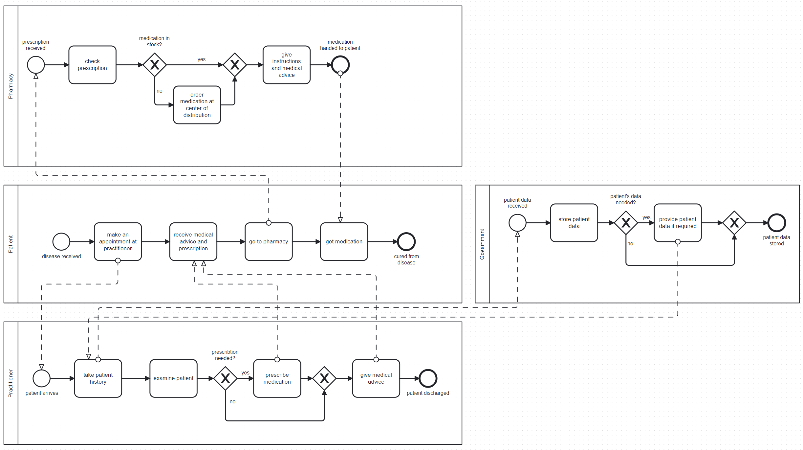

# Team-Rolex - Fast medication automation

## Team Members 👩🏽‍⚕️👩🏻‍⚕️👩🏻‍⚕️👨🏽‍⚕️

| Names  | Emails |
| ------------- | ------------- |
| Sebastian Fernandez | sebastian.fernandez@students.fhnw.ch |
| Bojana Chen | bojana.chen@students.fhnw.ch |
| Gerardo Romeny | gerardo.romenykunstmann@students.fhnw.ch |
| Magdalena Hardegger | magdalena.hardegger@students.fhnw.ch |

## Links 🔗
- API: [DeepNote](https://deepnote.com/workspace/daught-90c8f362-c010-4677-9f84-fd2c734b75ff/project/Sebastians-Untitled-project-927aa70e-3479-4236-ae8d-88111fb4fd4f/notebook/EHR-System-6c884184676d4ab89132c5ffc9ce726a?) (Latest Version )
- Google Forms: [Prescription](https://docs.google.com/forms/d/e/1FAIpQLSfTyC9M5EsB9jfqm9VB2KIwuVtSYK3EG5AdTjiTN4MWRj9KTg/viewform)
- Voiceflow Webchat: [Choose your pharmacy](https://digibp.github.io/Team-Rolex/)
- Make [EHR-System_Team-Rolex_PerscriptionRegistration-Form](https://eu2.make.com/134029/scenarios/419988/edit)
- Make [EHR-System_Team-Rolex-SendNotification](https://eu2.make.com/134029/scenarios/448010/edit)
- Camunda Rest-API: [Process_EHR-System_Rolex](https://digibp.herokuapp.com/camunda/app/cockpit/default/#/process-definition/Process_EHR-System-Rolex:3:581bed4c-8f98-11ee-8346-0ef7632af0f1/runtime?searchQuery=%5B%5D&viewbox=%7B%22Definitions_0tw53ak%22:%7B%22x%22:-594.8964705882353,%22y%22:74.02823529411765,%22width%22:3270.5882352941176,%22height%22:922.3529411764706%7D%7D)
- Postman Collection: [Postman](https://api.postman.com/collections/17747638-4a7ad2fc-d1fb-44e6-83de-47e54acbad06?access_key=PMAT-01HFJ0GZEPAGA1G9RVPENQW5PT)

## Coach
- Andreas Martin
- Charuta Panda

## Introduction
This repository contains our group project contribution to the “Digitalization of Business Processes in Healthcare” module at FHNW.

Every year about 20’000 hospitalizations are caused by incidents with erroneous medication in Switzerland. Although not all of these incidents originate from prescribing medication it is a critical source of errors for possible iatrogenic harm of patients. Our solution – “Fast medication automation” – addresses this potential source of harm to patients and significant cost driver in the health care system.
Prescribing medication is done multiple times in most doctors’ daily routine. A traditional paper prescription pad or a print out of a text editor generated template is still predominantly used, despite the advent of the first digital solutions. Therefore, we aimed at developing a supportive system to not only enhance the safety of patient treatments but also to create a facilitated administrative workflow.
We envision that the currently used Swiss electronic health record (EHR; German: EPD, elektronisches Patientendossier) shall be amended with a nationwide consistent prescribing tool: Fast medication automation. Our tool will combine multiple commonly used preventive tools to be executed in a fully automated manner, equipped with sophisticated notification tools enabling short and precise communication. 

## Goal 🎯
Our project aims at integrating a process which handles prescriptions with fully automated error preventive tools, stores data on the EHR, facilitates medication collection at pharmacies and simplifies interactions between involved health service providers. The integrated process we envision to apply even reduces the administrative workload of all stakeholders involved. In its entirety this will lead to secure, cost effective and streamlined workflows that result in most satisfied customers.

## Current As-Is Process

___________

### Issues with the current As-Is Process 🚩

___________

## To-Be Process

### Benefits ✔️

___________

### Scenario

## Fully automated process

## Conclusion

## Disclaimer
1.	We are aware that the process is handling sensitive personal data according to the Federal Act on Data Protection (FADP) and that these data require the utmost protection. We are aware of the risks that could occur such as for example breach of secrecy, breach of confidentiality, violation of integrity and lack of availability.
Fort this project, as we are in a testing environment with fictional data, the rules for Data Protection do not apply and we are focusing on the process itself. Therefore, we did not resile to use open platform tools like Google Forms and Voiceflow to illustrate our conception of the future-process.

2.	We are aware that our prescription form does not fulfill regulatory requirements. Especially, medication needs to be provided in a specific way and contain more information such as package size, dosage, medication use, etc. Nevertheless, it contains all important information and should represents the procedure itself, as our project focuses on fulfilling multiple automated error preventing tasks. At the moment, only the active pharmaceutical ingredient should be prescribed.

3.	Our project aims to connect to the EHR. Therefore, only registered patients will be able to enjoy full service. As we created only a very simplified registry, we work with names instead of unique identifying numbers like the AHV-number.

